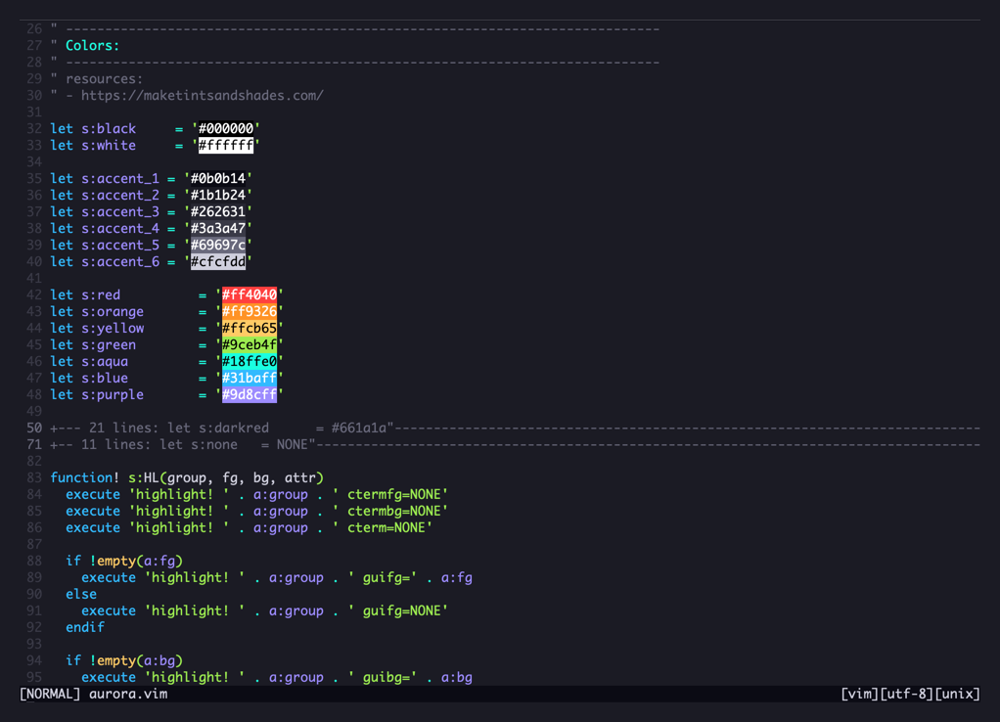

---

### Installation

Install it using your favourite package manager

#### With vim-plug

```vim
Plug 'rafalbromirski/vim-aurora'
```

### Usage

Currently it only supports `dark` background. There is no plan to release another version in the nearest future. Small
interactions and changes in colors might happen due to constant improvements.

If you want to contribute, feel free to open a PR / Issue.
